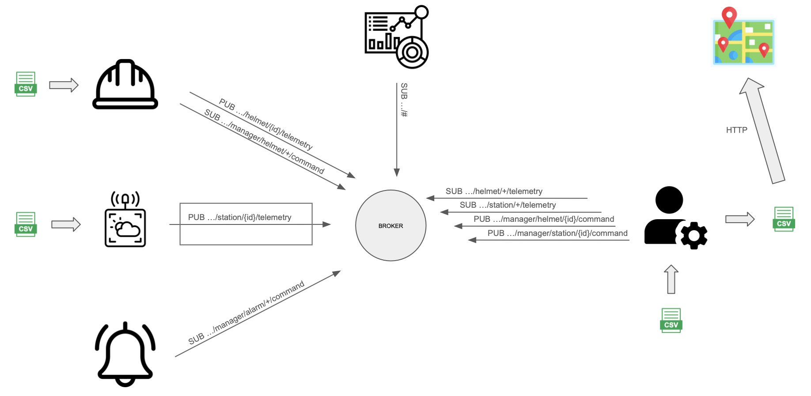

# Construction Site Monitoring System



**Figure 1:** High-level architecture of the Construction Site Monitoring System.

Industrial IoT system for real-time monitoring of construction sites, enhancing worker safety through automated tracking, environmental sensing, and intelligent alarm management. The system integrates wearable devices, environmental stations, and a centralized management logic to detect safety violations and manage site-wide alerts.

Project for the course **"Intelligent Internet of Things"**, part of the Bachelor's Degree in **Computer Engineering** at the **Mantova campus of UNIMORE**, during the third year of study.

---

## Table of Contents
- [High-Level Architecture & Main Components](#high-level-architecture--main-components)
- [System Features](#system-features)
- [Data Models](#data-models)
- [Protocols & Communication](#protocols--communication)
  - [MQTT Topics & Data](#mqtt-topics--data)
  - [MQTT Topics & Service Mapping](#mqtt-topics--service-mapping)
- [How to Run](#how-to-run)

---

## High-Level Architecture & Main Components

The system follows an IoT hub-and-spoke architecture where an MQTT broker facilitates asynchronous communication between distributed edge components and the central control logic.

- **Edge Layer (IoT Devices)**
  - **Worker Smart Helmet**: Wearable device for safety tracking.
    - **GPS**: Real-time worker positioning.
    - **Battery Sensor**: Health status monitoring.
    - **Multicolor LED**: Visual feedback for the worker (Work/Charge).
  - **Environmental Monitoring Station**: Stationary/Mobile sensing units.
    - **Sensors**: Fine dust (PM), Noise levels (dB), and Dangerous gas presence.
    - **GPS**: Location tracking for dynamic danger zone mapping.
  - **Safety Alarm System**: Site-wide alert actuator.
    - **Acoustic Siren**: Audible alert for emergency situations.
    - **Display**: Real-time visualization of dangerous sector IDs.

- **Storage & Backend Layer**
  - **Data Collector & Manager**: The "brain" of the system. It processes telemetry, validates safety rules (geofencing, thresholds), and issues commands to actuators.
  - **Local Persistence**: Historical data and site configuration stored in CSV files for analysis.

- **Application Layer**
  - **Real-Time Dashboard**: Terminal-based UI for system monitoring.
  - **Web Interface**: Browser-based visualization of the site map, workers, and environmental data.

---

## System Features

### Real-Time Worker Tracking with Geofencing
The manager continuously monitors worker positions. If a worker enters a sector marked as **dangerous** (due to environmental hazards), the system triggers the site-wide siren to alert the site.

### Intelligent Battery Management
Wearable devices report battery levels. When the battery drops below **10%**, the worker is instructed to stop and recharge. The helmet LED switches to **Yellow** during charging and returns to **Green** once fully charged.

### Dynamic Environmental Monitoring
Stations monitor air quality and noise. If thresholds are exceeded (e.g., high dust or gas leak), all sectors within a **10-meter radius** are dynamically marked as dangerous. This protection moves with the station if it is repositioned.

---

## Data Models

All data is exchanged using JSON payloads. Timestamps are represented as Unix epoch time (seconds/milliseconds) for temporal correlation.

**Helmet Telemetry Model**
| Field | Type | Description |
| :--- | :--- | :--- |
| `id` | String | Unique identifier for the helmet |
| `latitude` | Double | GPS Latitude |
| `longitude` | Double | GPS Longitude |
| `battery` | Integer | Level (0-100%) |
| `led` | Integer | State (0: Work, 1: Charge) |
| `timestamp` | Long | Unix epoch timestamp |

**Station Telemetry Model**
| Field | Type | Description |
| :--- | :--- | :--- |
| `id` | String | Unique identifier for the station |
| `latitude` | Double | GPS Latitude |
| `longitude` | Double | GPS Longitude |
| `dust` | Double | PM level measurement |
| `noise` | Double | Noise level (dB) |
| `gas` | Double | Gas concentration/presence |
| `timestamp` | Long | Unix epoch timestamp |

**Command Model (Manager -> Actuator)**
| Field | Type | Description |
| :--- | :--- | :--- |
| `command` | String | Action to perform (e.g., `set_led`, `turn_siren_on`) |
| `led`/`zones` | Mixed | Contextual parameters for the command |
| `timestamp` | Long | Unix epoch timestamp |

---

## Protocols & Communication

MQTT is used as the primary communication protocol due to its lightweight nature and support for intermittent connectivity.

### MQTT Topics & Data

**Helmet Telemetry**
- **Topic**: `helmet/{id}/telemetry`
- **Payload**:
  ```json
  {
    "id": "001",
    "latitude": 45.1602,
    "longitude": 10.7874,
    "battery": 85,
    "led": 0,
    "timestamp": 1736698123.45
  }
  ```
- **QoS**: 0 (Best effort for high-frequency updates)

**Station Telemetry**
- **Topic**: `station/{id}/telemetry`
- **Payload**:
  ```json
  {
    "id": "S01",
    "latitude": 45.1590,
    "longitude": 10.7880,
    "dust": 35.5,
    "noise": 45.0,
    "gas": 0.0,
    "timestamp": 1736698124.00
  }
  ```
- **QoS**: 1 (Ensures monitoring data is received)

### MQTT Topics & Service Mapping

| Topic Pattern | Purpose | Publisher | Subscriber |
| :--- | :--- | :--- | :--- |
| `helmet/+/telemetry` | Worker status updates | Helmets | Manager, Dashboard |
| `station/+/telemetry` | Environmental status | Stations | Manager, Dashboard |
| `manager/helmet/{id}/command` | LED Control (Charge/Danger) | Manager | Helmet |
| `manager/alarm/{id}/command` | Siren & Display control | Manager | Alarm |

---

## How to Run

1. **Install Dependencies**:
   ```bash
   pip install -r requirements.txt
   ```
2. **Configure Environment**:
   Copy `.env.example` to `.env` and configure your MQTT broker settings.
3. **Start the System**:
   ```bash
   python3 run_scenario.py
   ```
4. **Monitor the Site**:
   - **Dashboard**: `python3 src/dashboard.py`
   - **Web UI**: Access [http://localhost:5001](http://localhost:5001) in your browser.

---
Project developed by **Saajan Saini**
